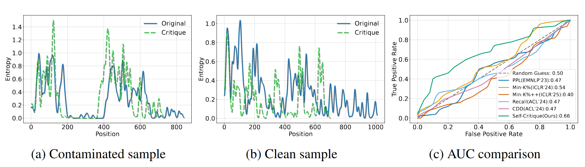
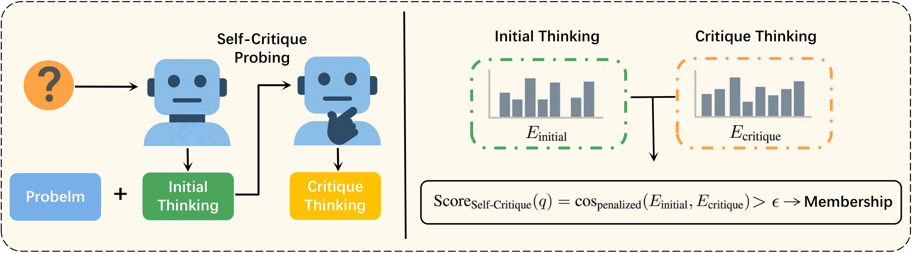
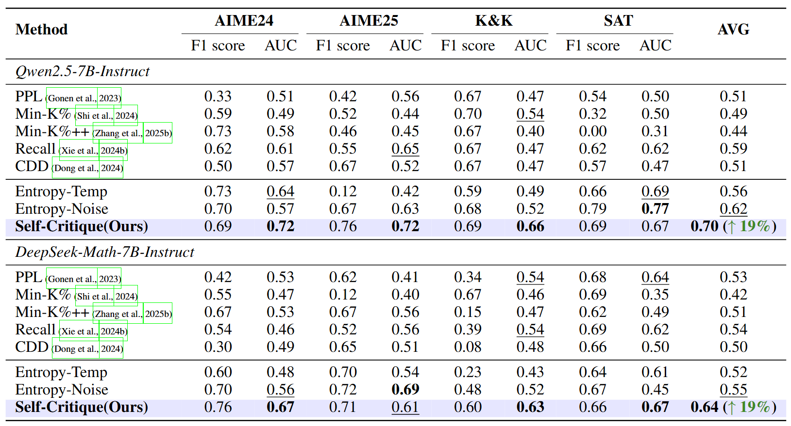

<div align="center">

<h1 style="display: flex; justify-content: center; align-items: center; gap: 10px; margin: 0;">
  Detecting Data Contamination from Reinforcement Learning Post-training for Large Language Models
</h1>
<p align="center"><em>The first systematic study of data contamination detection in RL post-training scenarios.</em></p>

[](https://arxiv.org/abs/2510.09259) [](https://www.alphaxiv.org/abs/2510.09259) 

<div align="center">
  
</div>


<!--  -->

</div>

---

# 📚 Overview
- 📖 [Introduction](#introduction)  
- ✨ [Getting Started](#getting-started)  
- 🔧 [Usage](#usage)  
- 🎯 [Main Results](#main-results)
<!-- - 📃 [Evaluation](#evaluation)   -->
- 🎈 [Citation](#citation)  

---

# 📖Introduction

Data contamination poses a significant threat to the reliable evaluation of Large Language Models (LLMs). This issue arises when benchmark samples may inadvertently appear in training sets, compromising the validity of reported performance. While detection methods have been developed for the pre-training and Supervised Fine-Tuning stages, a critical research gap exists for the increasingly significant phase of Reinforcement Learning (RL) post-training.

As RL post-training becomes pivotal for advancing LLM reasoning, the absence of specialized contamination detection methods in this paradigm presents a critical vulnerability. To address this, we conduct the first systematic study of data detection within RL post-training scenario and propose **Self-Critique**.

### Key Highlights:
- **First RL Contamination Study:** Systematic investigation of data contamination detection in RL post-training scenarios
- **Self-Critique Method:** Novel detection approach that probes for policy collapse through entropy analysis
- **RL-MIA Benchmark:** Comprehensive benchmark for evaluating contamination detection methods in RL settings
<!-- - **Significant Performance Gains:** Up to 30% AUC improvement over existing baseline methods -->


<div align="center">
  
</div>


<!--  -->

---

# ✨Getting Started

## Installation

You can install the dependencies by running the following commands:

```bash
# Create conda environment
conda create -n self_critique python=3.10
conda activate self_critique

cd RL_Contaminate/verl
pip install -r requirements.txt
pip install -e .

cd verl
pip install -e .
```

## Repo Structure

This repository includes:

- `detectors/`: Implementation of various contamination detection methods including our proposed Self-Critique
- `benchmarks/`: RL-MIA benchmark datasets for different tasks (GSM8k, AIME, SAT, etc.)
- `RL_Contaminate/`: RL training framework and scripts for generating contaminated models
- `eval_scripts/`: Evaluation scripts for testing detection methods across different models and scenarios

---

# 🔧Usage

First, we need to train models to simulate RL-stage data contamination, for example:

```bash
cd RL_Contaminate
bash ./train_scripts/aime_aime25/train_grpo_RLMIA_qwen_math.sh
```

Then we can use the corresponding test scripts to evaluate the effectiveness of different detection methods:

```bash
cd ..
bash ./eval_scripts/Qwen2.5-Math-7B/run_full_workflow_qwen_math_aime.sh
bash ./eval_scripts/Qwen2.5-Math-7B/run_full_workflow_qwen_math_aime25.sh
``` 

The same process applies to other models and datasets;


For the DUAL-STAGE CONTAMINATION IN PRE-TRAINING & RL experiments, follow the same workflow:

```bash
cd RL_Contaminate
bash ./train_scripts/gsm8k/train_ppo_qwen_0.5b_gsm8k.sh
```

Then

```bash
cd ..
bash ./eval_scripts/Lower_Pretraining/run_Qwen2.5-0.5B-Instruct.sh
``` 

---


# 🎯 Main Results

Our Self-Critique method significantly outperforms existing detection methods:


<div align="center">
  
</div>


<!-- 更简单的Markdown方式：
 -->

# 🎈 Citation
If you find our data, or code useful, please kindly cite our paper.

```bib
@misc{rl-data-contamination,
      title={Detecting Data Contamination from Reinforcement Learning Post-training for Large Language Models}, 
      author={Yongding Tao and Tian Wang and Yihong Dong and Huanyu Liu and Kechi Zhang and Xiaolong Hu and Ge Li},
      year={2025},
      eprint={2510.09259},
      archivePrefix={arXiv},
      primaryClass={cs.CL},
      url={https://arxiv.org/abs/2510.09259}, 
}
```